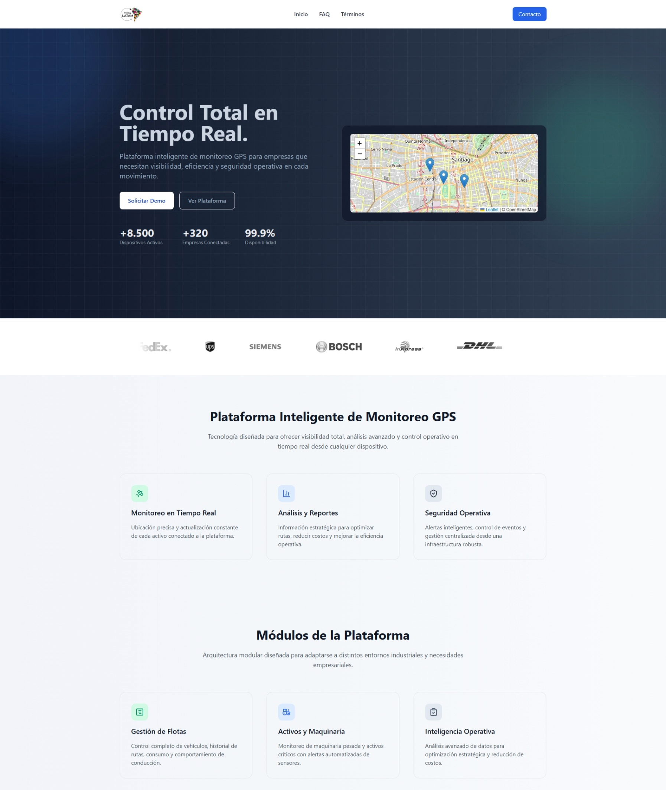
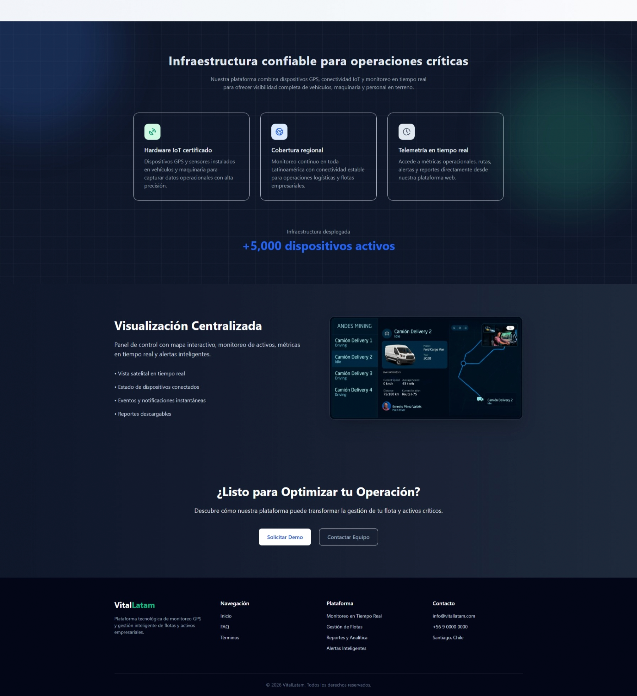

## 🌐 Web Project – 🚛 Fleet Intelligence Platform – React SEO & Performance Optimized SPA

Aplicación web tipo SaaS desarrollada con **React + Vite**, enfocada en **SEO técnico moderno, Web Performance Optimization (WPO)** y arquitectura frontend escalable.

El proyecto simula una plataforma inteligente de monitoreo GPS y gestión de flotas empresariales, implementando buenas prácticas modernas de frontend engineering, accesibilidad y optimización de Core Web Vitals.


## 🌍 Demo en vivo
[](https://fleet-intelligence-platform.vercel.app/)

---

## 📷 Vista previa

<p align="center">
  
  
</p>

---

## 🚀 Tecnologías utilizadas

- React
- Vite
- JavaScript ES6+
- Tailwind CSS
- React Router DOM
- Zustand
- React Helmet Async
- Lucide React
- Leaflet Maps
- Vercel

---

## 📂 Estructura del proyecto
```
/public
  /images
    robots.txt
    sitemap.xml
/scripts
  generate-sitemap.js
/src
  /components
    /layout
    /sections
    /ui
  /hooks
  /pages
  /seo
    /config
    /generators
    /structured-data
  /store
  /constants
App.jsx
main.jsx
```
---

## 🎯 Características Principales

### ⚡ SEO Optimization

- Gestión dinámica de metadatos
- URL canónicas
- Open Graph y Twitter Cards
- Datos estructurados (JSON-LD)
- Esquema de preguntas frecuentes
- Esquema de organización
- Esquema de aplicación de software
- Generación dinámica de mapas del sitio
- Configuración de robots.txt
- Estructura HTML semántica
- Arquitectura SEO optimizada para SPA

### 🚀 Web Performance Optimization (WPO)

- Carga diferida con React.lazy + Suspense
- División de código basada en rutas
- Optimización de Core Web Vitals
- Estrategias de reducción de CLS
- Optimización de la entrega de imágenes (WebP)
- Optimización de la ruta de renderizado crítica
- Arquitectura de componentes ligera
- Compilaciones de producción optimizadas con Vite

### 🎨 UI / UX

- Página de inicio SaaS responsive
- Modo claro/oscuro con estado
- Estado de tema persistente con almacenamiento local
- Transiciones de interfaz fluidas
- Arquitectura de componentes reutilizables
- Sistema de diseño moderno basado en Tailwind
- Mejoras de accesibilidad (orientadas a WCAG)

---

## 📊 Lighthouse Results

- Performance	99
- Accessibility	94
- Best Practices	100
- SEO	100

---

## 🌐 Deployment

El proyecto está desplegado en:

- Vercel
- Configuración SPA rewrites para React Router
- Deploy continuo conectado a GitHub

---

## 🧠 Objetivo del proyecto

Este proyecto fue desarrollado para profundizar conocimientos en:

- SEO técnico aplicado a SPAs React
- Web Performance Optimization
- Arquitectura frontend moderna
- Accesibilidad web
- Render optimization
- Lazy loading & code splitting
- State management con Zustand
- Optimización de Core Web Vitals

---

## 📌 Mejoras futuras

- Migración completa a TypeScript
- Migración futura a Next.js
- Integración con backend .NET 8 API
- Analytics avanzado con GA4
- E2E Testing con Playwright
- Unit Testing con Vitest/Jest

---

## 👨‍💻 Autor

**Jorge Vargas**
